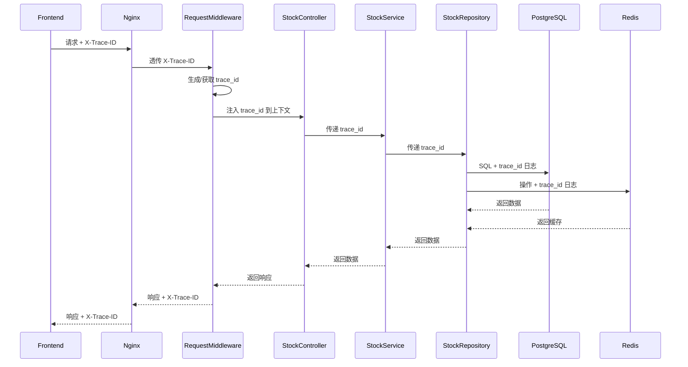

# 股票数据平台 - 技术架构文档

## 1. 架构设计

\\\mermaid
graph TB
    subgraph 前端层
        FE[Vue3 + TypeScript]
        PINIA[Pinia状态管理]
        ROUTER[Vue Router]
        UI[Naive UI]
        WS[WebSocket客户端]
        CACHE[LocalStorage/SessionStorage]
    end

    subgraph 反向代理层
        NGINX[Nginx]
    end

    subgraph 后端层
        FASTAPI[FastAPI]
        AUTH[JWT认证中间件]
        WS_SERVER[WebSocket服务]
        SCHEDULER[APScheduler定时任务]
        
        subgraph 应用层
            USER[用户模块]
            STOCK[股票模块]
            TASK[任务模块]
            CHAT[AI问答模块]
            MSG[消息模块]
        end
        
        subgraph 基础设施层
            PG[PostgreSQL]
            MONGO[MongoDB]
            REDIS[Redis]
            ETCD[etcd]
        end
    end

    subgraph 外部服务
        BAOSTOCK[Baostock API]
        QWEN[通义千问]
        DEEPSEEK[DeepSeek]
    end

    FE --> NGINX
    NGINX --> FASTAPI
    NGINX --> WS_SERVER
    
    FASTAPI --> AUTH
    FASTAPI --> APPLICATION
    
    APPLICATION --> PG
    APPLICATION --> MONGO
    APPLICATION --> REDIS
    APPLICATION --> ETCD
    
    SCHEDULER --> TASK
    TASK --> BAOSTOCK
    
    CHAT --> QWEN
    CHAT --> DEEPSEEK
    
    WS_SERVER --> REDIS
    
    FE --> WS
    WS --> WS_SERVER
\\\

---

## 2. 技术栈描述

### 2.1 前端技术栈

| 技术 | 版本 | 用途 |
|------|------|------|
| Vue | 3.4+ | 前端框架 |
| TypeScript | 5.4+ | 类型安全 |
| Pinia | 2.1+ | 状态管理 |
| Vue Router | 4.3+ | 路由管理 |
| Naive UI | 2.38+ | UI组件库 |
| ECharts | 5.5+ | K线图绘制 |
| Axios | 1.6+ | HTTP客户端 |
| Vite | 5.2+ | 构建工具 |

### 2.2 后端技术栈

| 技术 | 版本 | 用途 |
|------|------|------|
| FastAPI | 0.110+ | Web框架 |
| Python | 3.11+ | 编程语言 |
| SQLAlchemy | 2.0+ | ORM |
| Alembic | 1.12+ | 数据库迁移 |
| Pydantic | 2.6+ | 数据验证 |
| PyJWT | 2.8+ | JWT认证 |
| APScheduler | 3.10+ | 定时任务 |
| WebSocket | 内置 | 实时通信 |

### 2.3 数据库技术栈

| 技术 | 版本 | 用途 |
|------|------|------|
| PostgreSQL | 16+ | 关系型数据存储 |
| MongoDB | 7.0+ | 文档数据存储 |
| Redis | 7.2+ | 缓存与Session |
| etcd | 3.5+ | 配置与分布式锁 |

### 2.4 部署技术栈

| 技术 | 版本 | 用途 |
|------|------|------|
| Docker | 24+ | 容器化 |
| Docker Compose | 2.24+ | 编排工具 |
| Nginx | 1.25+ | 反向代理 |

---

## 3. 路由定义

### 3.1 前端路由

| 路由 | 组件 | 权限 | 用途 |
|------|------|------|------|
| /login | LoginPage | 公开 | 用户登录 |
| / | DashboardPage | 认证 | 仪表盘首页 |
| /stocks | StockListPage | 认证 | 股票列表 |
| /stocks/:code | StockDetailPage | 认证 | 股票详情/K线图 |
| /tasks | TaskListPage | 认证 | 采集任务列表 |
| /tasks/scheduler | SchedulerPage | 认证 | 定时任务配置 |
| /chat | ChatPage | 认证 | AI问答 |
| /messages | MessagePage | 认证 | 消息中心 |

### 3.2 后端API路由

| 路由前缀 | 模块 | 用途 |
|----------|------|------|
| /api/v1/auth | 认证模块 | 登录、Token刷新 |
| /api/v1/stocks | 股票模块 | 股票数据查询 |
| /api/v1/tasks | 任务模块 | 采集任务管理 |
| /api/v1/chat | 问答模块 | AI问答接口 |
| /api/v1/messages | 消息模块 | 消息管理 |
| /ws | WebSocket | 实时通信 |

---

## 4. API定义

### 4.1 认证模块

#### 4.1.1 登录接口

**POST /api/v1/auth/login**

请求体：
`json
{
  "username": "string (必填)",
  "password": "string (必填)"
}
`

响应体：
`json
{
  "code": 200,
  "message": "success",
  "data": {
    "access_token": "string",
    "refresh_token": "string",
    "token_type": "Bearer",
    "expire_at": "datetime"
  }
}
`

#### 4.1.2 Token刷新

**POST /api/v1/auth/refresh**

请求头：Authorization: Bearer <refresh_token>

响应体：
`json
{
  "code": 200,
  "message": "success",
  "data": {
    "access_token": "string",
    "expire_at": "datetime"
  }
}
`

### 4.2 股票模块

#### 4.2.1 获取股票列表

**GET /api/v1/stocks**

查询参数：
- page: number (页码，默认1)
- size: number (每页数量，默认20)
- keyword: string (搜索关键词)
- min_price: number (最低价格)
- max_price: number (最高价格)

响应体：
`json
{
  "code": 200,
  "message": "success",
  "data": {
    "items": [
      {
        "code": "string (股票代码)",
        "name": "string (股票名称)",
        "open_price": "number (开盘价)",
        "close_price": "number (收盘价)",
        "high_price": "number (最高价)",
        "low_price": "number (最低价)",
        "volume": "number (成交量)",
        "update_time": "datetime"
      }
    ],
    "total": "number (总数)",
    "page": "number (当前页)",
    "size": "number (每页数量)"
  }
}
`

#### 4.2.2 获取股票K线数据

**GET /api/v1/stocks/{code}/kline**

路径参数：
- code: string (股票代码)

查询参数：
- period: string (周期：day/week/month/5min/15min/30min/60min)
- start_date: string (开始日期 YYYY-MM-DD)
- end_date: string (结束日期 YYYY-MM-DD)

响应体：
`json
{
  "code": 200,
  "message": "success",
  "data": [
    {
      "date": "string (日期)",
      "open": "number (开盘价)",
      "close": "number (收盘价)",
      "high": "number (最高价)",
      "low": "number (最低价)",
      "volume": "number (成交量)",
      "amount": "number (成交额)"
    }
  ]
}
`

### 4.3 任务模块

#### 4.3.1 获取任务列表

**GET /api/v1/tasks**

响应体：
`json
{
  "code": 200,
  "message": "success",
  "data": [
    {
      "id": "string (任务ID)",
      "name": "string (任务名称)",
      "api_name": "string (API名称)",
      "status": "string (状态：pending/running/success/failed)",
      "progress": "number (进度 0-100)",
      "last_run_time": "datetime",
      "next_run_time": "datetime",
      "config": "json (配置信息)",
      "error_message": "string (错误信息)"
    }
  ]
}
`

#### 4.3.2 触发任务

**POST /api/v1/tasks/{task_id}/run**

请求体：
`json
{
  "config": "json (任务配置)"
}
`

响应体：
`json
{
  "code": 200,
  "message": "success",
  "data": {
    "task_id": "string",
    "status": "running"
  }
}
`

#### 4.3.3 获取任务配置模板

**GET /api/v1/tasks/{task_id}/config-template**

响应体：
`json
{
  "code": 200,
  "message": "success",
  "data": {
    "template": "json (配置模板)",
    "description": "string (配置说明)"
  }
}
`

### 4.4 定时任务模块

#### 4.4.1 获取定时任务列表

**GET /api/v1/tasks/scheduler**

响应体：
`json
{
  "code": 200,
  "message": "success",
  "data": [
    {
      "id": "string (任务ID)",
      "name": "string (任务名称)",
      "task_id": "string (关联任务ID)",
      "cron_expression": "string (CRON表达式)",
      "status": "string (状态：active/inactive)",
      "config": "json (配置信息)",
      "last_run_time": "datetime",
      "next_run_time": "datetime"
    }
  ]
}
`

#### 4.4.2 创建定时任务

**POST /api/v1/tasks/scheduler**

请求体：
`json
{
  "name": "string (必填)",
  "task_id": "string (必填)",
  "cron_expression": "string (必填)",
  "config": "json (任务配置)"
}
`

响应体：
`json
{
  "code": 200,
  "message": "success",
  "data": {
    "id": "string",
    "name": "string",
    "status": "active"
  }
}
`

### 4.5 AI问答模块

#### 4.5.1 发送问答请求

**POST /api/v1/chat**

请求体：
`json
{
  "question": "string (必填)",
  "models": ["string (模型名称列表)"],
  "reference_content": "string (引用内容)"
}
`

响应体：
`json
{
  "code": 200,
  "message": "success",
  "data": [
    {
      "model": "string (模型名称)",
      "response": "string (模型响应)",
      "response_time": "number (响应时间ms)"
    }
  ]
}
`

#### 4.5.2 获取问答历史

**GET /api/v1/chat/history**

查询参数：
- page: number (页码)
- size: number (每页数量)

响应体：
`json
{
  "code": 200,
  "message": "success",
  "data": {
    "items": [
      {
        "id": "string",
        "question": "string",
        "responses": "array",
        "created_at": "datetime"
      }
    ],
    "total": "number"
  }
}
`

### 4.6 消息模块

#### 4.6.1 获取消息列表

**GET /api/v1/messages**

查询参数：
- page: number (页码)
- size: number (每页数量)
- status: string (阅读状态：all/read/unread)
- type: string (消息类型)

响应体：
`json
{
  "code": 200,
  "message": "success",
  "data": {
    "items": [
      {
        "id": "string",
        "title": "string",
        "content": "string",
        "type": "string (类型)",
        "related_task_id": "string (关联任务)",
        "status": "string (阅读状态)",
        "created_at": "datetime"
      }
    ],
    "total": "number"
  }
}
`

#### 4.6.2 标记消息已读

**PUT /api/v1/messages/{message_id}/read**

响应体：
`json
{
  "code": 200,
  "message": "success",
  "data": null
}
`

#### 4.6.3 批量操作

**POST /api/v1/messages/batch**

请求体：
`json
{
  "message_ids": ["string"],
  "action": "string (read/delete)"
}
`

---

## 5. 服务器架构图

\\\mermaid
graph LR
    subgraph Controller
        AUTH_CTL[AuthController]
        STOCK_CTL[StockController]
        TASK_CTL[TaskController]
        CHAT_CTL[ChatController]
        MSG_CTL[MessageController]
    end
    
    subgraph Service
        AUTH_SVC[AuthService]
        STOCK_SVC[StockService]
        TASK_SVC[TaskService]
        CHAT_SVC[ChatService]
        MSG_SVC[MessageService]
    end
    
    subgraph Repository
        AUTH_REPO[UserRepository]
        STOCK_REPO[StockRepository]
        TASK_REPO[TaskRepository]
        CHAT_REPO[ChatRepository]
        MSG_REPO[MessageRepository]
    end
    
    subgraph Database
        PG_DB[(PostgreSQL)]
        MONGO_DB[(MongoDB)]
        REDIS_DB[(Redis)]
        ETCD_DB[(etcd)]
    end
    
    AUTH_CTL --> AUTH_SVC
    STOCK_CTL --> STOCK_SVC
    TASK_CTL --> TASK_SVC
    CHAT_CTL --> CHAT_SVC
    MSG_CTL --> MSG_SVC
    
    AUTH_SVC --> AUTH_REPO
    STOCK_SVC --> STOCK_REPO
    TASK_SVC --> TASK_REPO
    CHAT_SVC --> CHAT_REPO
    MSG_SVC --> MSG_REPO
    
    AUTH_REPO --> PG_DB
    AUTH_REPO --> REDIS_DB
    STOCK_REPO --> PG_DB
    STOCK_REPO --> REDIS_DB
    TASK_REPO --> PG_DB
    TASK_REPO --> REDIS_DB
    TASK_REPO --> ETCD_DB
    CHAT_REPO --> MONGO_DB
    MSG_REPO --> PG_DB
    MSG_REPO --> REDIS_DB
\\\

---

## 6. 数据模型

### 6.1 数据模型定义

\\\mermaid
erDiagram
    USER ||--o{ MESSAGE : receives
    USER ||--o{ CHAT_HISTORY : creates
    TASK ||--o{ TASK_EXECUTION : has
    TASK ||--o{ SCHEDULER : schedules
    STOCK ||--o{ KLINE_DATA : has
    
    USER {
        string id PK
        string username UK
        string password_hash
        string role
        datetime created_at
        datetime updated_at
    }
    
    STOCK {
        string code PK
        string name
        string industry
        string exchange
        datetime created_at
        datetime updated_at
    }
    
    KLINE_DATA {
        string id PK
        string stock_code FK
        string period
        date date
        decimal open
        decimal close
        decimal high
        decimal low
        bigint volume
        decimal amount
        datetime created_at
    }
    
    TASK {
        string id PK
        string name
        string api_name
        json config_schema
        datetime created_at
        datetime updated_at
    }
    
    TASK_EXECUTION {
        string id PK
        string task_id FK
        string status
        int progress
        datetime start_time
        datetime end_time
        string error_message
        json result
    }
    
    SCHEDULER {
        string id PK
        string name
        string task_id FK
        string cron_expression
        json config
        string status
        datetime last_run_time
        datetime next_run_time
        datetime created_at
        datetime updated_at
    }
    
    MESSAGE {
        string id PK
        string user_id FK
        string title
        string content
        string type
        string related_task_id
        string status
        datetime created_at
    }
    
    CHAT_HISTORY {
        string id PK
        string user_id FK
        string question
        json responses
        datetime created_at
    }
\\\

---

## 7. 数据流

### 7.1 股票数据采集流程

\\\mermaid
sequenceDiagram
    participant Scheduler as APScheduler
    participant TaskService as TaskService
    participant Baostock as BaostockAPI
    participant StockRepo as StockRepository
    participant PG as PostgreSQL
    participant Redis as Redis
    participant WS as WebSocketServer
    
    Scheduler->>TaskService: 触发定时任务
    TaskService->>TaskService: 评估数据量，拆分任务
    loop 每个子任务
        TaskService->>Baostock: 请求股票数据
        alt 网络异常
            TaskService->>TaskService: 等待10-20秒重试
            TaskService->>Baostock: 重试请求
        else 成功
            Baostock-->>TaskService: 返回数据
            TaskService->>StockRepo: 保存数据
            StockRepo->>PG: 写入分表
            StockRepo->>Redis: 更新缓存
            TaskService->>WS: 推送进度消息
        end
    end
    TaskService->>WS: 推送任务完成消息
\\\

### 7.2 股票数据查询流程

\\\mermaid
sequenceDiagram
    participant FE as Frontend
    participant API as StockController
    participant Service as StockService
    participant Repo as StockRepository
    participant Redis as Redis
    participant PG as PostgreSQL
    participant WS as WebSocketServer
    
    FE->>API: 获取股票列表
    API->>Service: query_stocks()
    Service->>Redis: 检查缓存
    alt 缓存命中
        Redis-->>Service: 返回缓存数据
    else 缓存未命中
        Service->>Repo: query_from_db()
        Repo->>PG: SELECT * FROM stocks
        PG-->>Repo: 返回数据
        Repo->>Redis: 更新缓存
        Repo-->>Service: 返回数据
    end
    Service-->>API: 返回数据
    API-->>FE: JSON响应
    
    FE->>API: 获取K线数据
    API->>Service: get_kline_data()
    Service->>Repo: query_kline()
    Repo->>PG: SELECT FROM kline_day_{month}
    PG-->>Repo: 返回数据
    Repo-->>Service: 返回数据
    Service-->>API: 返回数据
    API-->>FE: JSON响应
    
    FE->>WS: 建立WebSocket连接
    WS->>Redis: 订阅股票更新
    loop 数据更新
        Redis-->>WS: 推送更新
        WS-->>FE: WebSocket消息
    end
\\\

### 7.3 WebSocket消息推送流程

\\\mermaid
sequenceDiagram
    participant FE as Frontend
    participant WS as WebSocketServer
    participant Redis as Redis
    participant Service as MessageService
    participant Repo as MessageRepository
    participant PG as PostgreSQL
    
    FE->>WS: 连接 /ws/messages?token=xxx
    WS->>WS: 验证Token，注册连接
    
    loop 新消息产生
        Service->>Repo: create_message()
        Repo->>PG: INSERT INTO messages
        PG-->>Repo: OK
        Repo->>Redis: PUBLISH message:{user_id}
        Redis-->>WS: 消息通知
        WS->>FE: WebSocket消息推送
    end
    
    FE->>WS: 标记消息已读
    WS->>Service: mark_as_read()
    Service->>Repo: update_status()
    Repo->>PG: UPDATE messages SET status='read'
\\\

---

## 8. 部署架构

### 8.1 Docker Compose 服务配置

| 服务名称 | 镜像 | 端口 | 数据卷 | 用途 |
|----------|------|------|--------|------|
| nginx | nginx:1.25 | 80/443 | ./nginx/conf:/etc/nginx/conf.d | 反向代理 |
| frontend | hs-stock-fe:latest | - | - | 前端应用 |
| backend | hs-stock-be:latest | 8000 | ./configs:/app/configs | 后端API |
| postgres | postgres:16 | 5432 | ./data/postgres:/var/lib/postgresql/data | 关系数据库 |
| mongodb | mongo:7.0 | 27017 | ./data/mongodb:/data/db | 文档数据库 |
| redis | redis:7.2 | 6379 | ./data/redis:/data | 缓存 |
| etcd | etcd:3.5 | 2379/2380 | ./data/etcd:/etcd-data | 配置存储 |

### 8.2 网络架构

`mermaid
graph LR
    subgraph Host Network
        HOST[Ubuntu 24.04]
        PORT80[80端口]
        PORT443[443端口]
    end
    
    subgraph Docker Network
        NET[hs-stock-network]
        NGINX[nginx]
        FE[frontend]
        BE[backend]
        PG[postgres]
        MONGO[mongodb]
        REDIS[redis]
        ETCD[etcd]
    end
    
    HOST --> PORT80 --> NGINX
    HOST --> PORT443 --> NGINX
    
    NGINX --> FE
    NGINX --> BE
    
    BE --> PG
    BE --> MONGO
    BE --> REDIS
    BE --> ETCD
    
    FE -.-> BE
`

---

## 9. 安全设计

### 9.1 认证机制

- JWT Token 认证
- Access Token 有效期 2小时
- Refresh Token 有效期 7天
- Token 存储在 Redis 中，支持黑名单

### 9.2 接口签名验证

第三方API请求签名算法：
`
signature = md5(
    private_key + 
    timestamp + 
    request_path + 
    md5(sorted_params)
)
`

### 9.3 数据保护

- 密码使用 BCrypt 加密存储
- 敏感字段传输使用 HTTPS
- 数据库连接使用 SSL

### 9.4 权限控制

- 基于角色的访问控制(RBAC)
- 接口级别权限验证
- 资源级别权限验证

---

## 10. 监控与日志

### 10.1 日志规范

- 结构化日志(JSON格式)
- 日志级别：DEBUG/INFO/WARN/ERROR/CRITICAL
- 日志输出到文件，按日期轮转
- 日志存储路径：`/var/log/hs-stock-platform/`
- 日志保留策略：30天

### 10.2 日志埋点设计

#### 10.2.1 关键代码位置埋点

| 埋点位置 | 日志级别 | 日志内容 | 用途 |
|----------|----------|----------|------|
| 请求入口(中间件) | INFO | trace_id, path, method, client_ip, user_id | 请求追踪 |
| 请求出口(中间件) | INFO | trace_id, status_code, duration_ms | 响应时间 |
| 认证失败 | WARN | trace_id, username, error_msg | 安全审计 |
| 数据库查询 | DEBUG | trace_id, query_sql, duration_ms, rows | 性能优化 |
| Redis操作 | DEBUG | trace_id, operation, key, duration_ms | 缓存优化 |
| 任务开始 | INFO | trace_id, task_id, task_name | 任务追踪 |
| 任务进度 | INFO | trace_id, task_id, progress, total_count | 进度监控 |
| 任务完成 | INFO | trace_id, task_id, status, duration | 任务统计 |
| 任务失败 | ERROR | trace_id, task_id, error_msg, stack_trace | 问题排查 |
| 第三方API调用 | INFO | trace_id, api_name, status_code, duration_ms | 外部依赖监控 |
| WebSocket连接 | INFO | trace_id, user_id, action(connect/disconnect) | 实时通信监控 |
| 异常捕获 | ERROR | trace_id, error_type, error_msg, stack_trace | 错误追踪 |

#### 10.2.2 日志格式定义

```json
{
  "timestamp": "2024-01-15T10:30:45.123Z",
  "trace_id": "a1b2c3d4-e5f6-7890-abcd-ef1234567890",
  "span_id": "span-001",
  "level": "INFO",
  "logger": "app.middleware.request",
  "message": "Request received",
  "fields": {
    "method": "GET",
    "path": "/api/v1/stocks",
    "client_ip": "192.168.1.100",
    "user_id": "user-001",
    "request_id": "req-001"
  },
  "duration_ms": 156,
  "status_code": 200
}
```

### 10.3 Trace ID 链路追踪

#### 10.3.1 Trace ID 生成与传递

- **生成位置**：请求入口中间件，使用 UUID4 生成
- **传递方式**：
  - HTTP请求：通过请求头 `X-Trace-ID` 传递
  - WebSocket：通过查询参数 `trace_id` 传递
  - 内部调用：通过上下文（Context）传递

#### 10.3.2 Trace ID 传播链路



#### 10.3.3 前端 Trace ID 实现

- 前端请求拦截器自动生成并附加 `X-Trace-ID`
- 响应拦截器提取并记录 `X-Trace-ID`
- 日志组件统一使用 trace_id 关联请求

```typescript
// 前端 Axios 拦截器示例
axios.interceptors.request.use((config) => {
  const traceId = uuidv4();
  config.headers['X-Trace-ID'] = traceId;
  return config;
});

axios.interceptors.response.use((response) => {
  const traceId = response.headers['x-trace-id'];
  console.log(`Request completed: ${traceId}`);
  return response;
});
```

#### 10.3.4 后端 Trace ID 中间件

```python
# 后端 FastAPI 中间件示例
from fastapi import Request
from uuid import uuid4

@app.middleware("http")
async def trace_id_middleware(request: Request, call_next):
    trace_id = request.headers.get("X-Trace-ID", str(uuid4()))
    request.state.trace_id = trace_id
    
    response = await call_next(request)
    response.headers["X-Trace-ID"] = trace_id
    
    return response
```

### 10.4 监控指标

- 请求响应时间（P50/P90/P99）
- 接口调用次数（QPS）
- 错误率（4xx/5xx）
- 数据库连接池状态
- Redis缓存命中率
- 任务执行成功率
- WebSocket连接数

### 10.5 告警机制

- 接口错误率超过5%告警
- 任务执行失败告警
- 数据库连接数超过80%告警
- 请求响应时间P99超过2秒告警
- Redis缓存命中率低于90%告警
